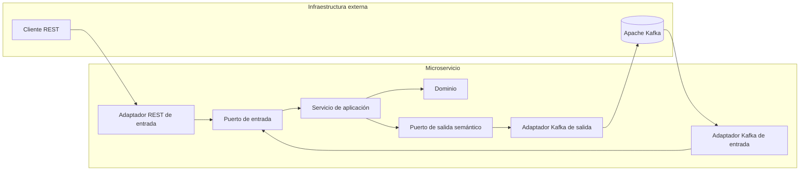
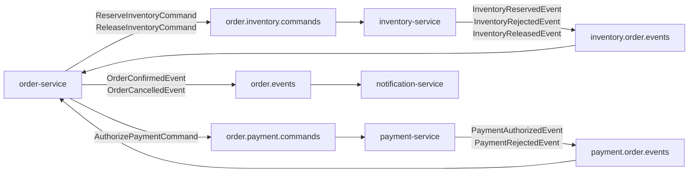
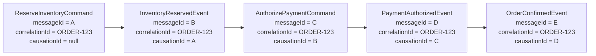
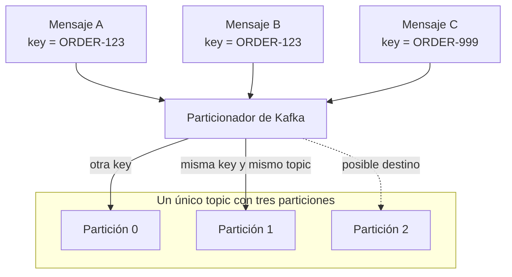
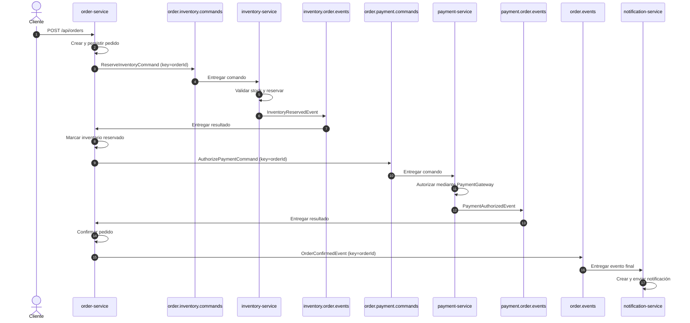
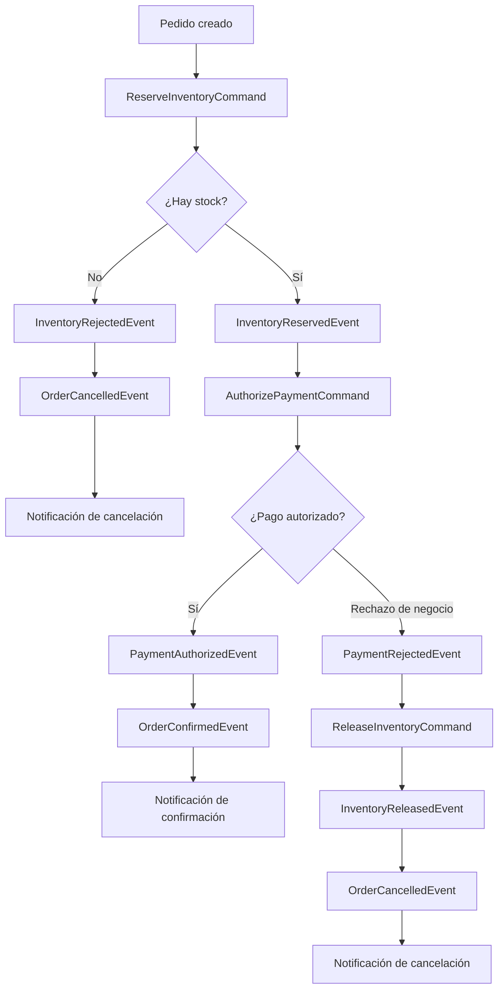
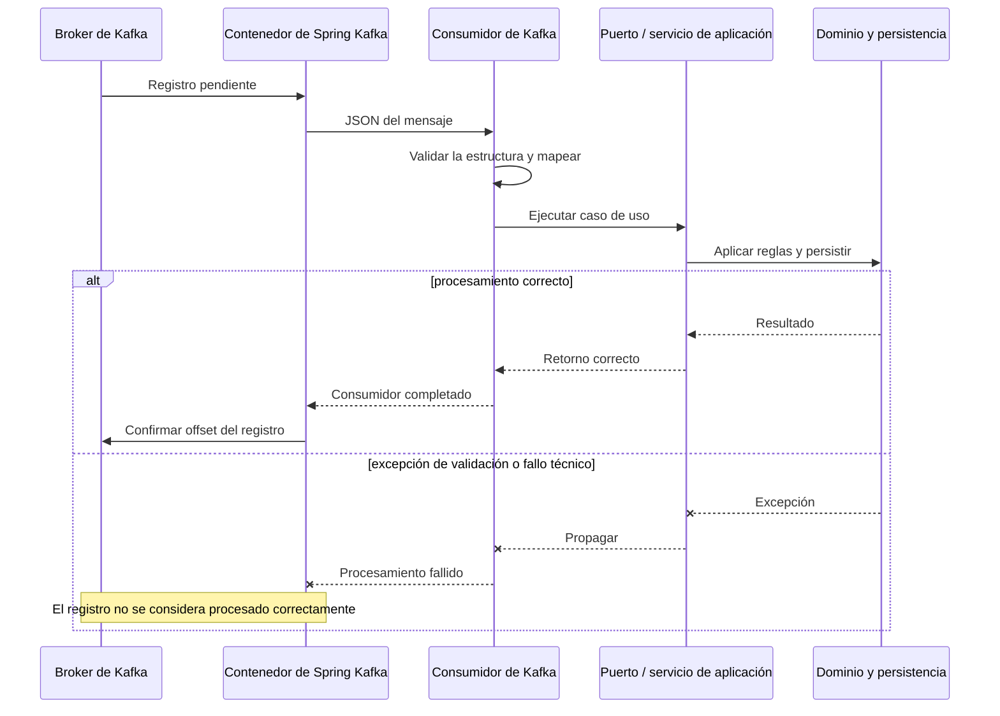

# OrderFlow

OrderFlow es un backend distribuido de referencia construido con microservicios JVM, Spring Boot,
Arquitectura Hexagonal, Domain-Driven Design y comunicación asíncrona mediante Apache Kafka.

El proyecto separa cuatro contextos delimitados independientes. Cada servicio tiene su propio proceso de compilación,
modelo de dominio, contratos de aplicación, adaptadores y persistencia. Kafka es exclusivamente un
detalle de infraestructura de los adaptadores: ni el dominio ni los casos de uso dependen de APIs de
Kafka.

## Contenido

- [Microservicios](#microservicios)
- [Papel de Kafka en OrderFlow](#papel-de-kafka-en-orderflow)
- [Topología de topics](#topología-de-topics)
- [Contratos y estructura](#contratos-y-estructura)
- [Clave, particiones y orden](#clave-particiones-y-orden)
- [Configuración común](#configuración-común)
- [Configuración por microservicio](#configuración-por-microservicio)
- [Flujos funcionales](#flujos-funcionales)
- [Procesamiento y offsets](#procesamiento-y-offsets)
- [Errores y semántica de entrega](#errores-y-semántica-de-entrega)
- [Pruebas](#pruebas)
- [Ejecución local](#ejecución-local)
- [Limitaciones conocidas](#limitaciones-conocidas)

## Microservicios

| Servicio | Lenguaje | Responsabilidad |
| --- | --- | --- |
| `order-service` | Java | Creación y ciclo de vida del pedido; punto natural de una futura orquestación Saga |
| `inventory-service` | Kotlin | Stock, reservas de inventario y liberación de reservas |
| `payment-service` | Kotlin | Autorización de pagos y abstracción del proveedor de pagos |
| `notification-service` | Kotlin | Notificaciones de confirmación y cancelación de pedidos |

Los cuatro servicios son compilables y desplegables de forma independiente. No comparten un JAR de
eventos, clases de dominio ni modelos de persistencia. La única frontera compartida entre contextos
delimitados es el contrato JSON publicado en Kafka.

## Papel de Kafka en OrderFlow

Kafka desacopla temporal y tecnológicamente los servicios. `order-service` no llama directamente a
Inventory, Payment o Notification: publica comandos o eventos y continúa su flujo cuando recibe los
resultados correspondientes.

Se utilizan dos categorías semánticas:

- **Comando**: solicitud dirigida a otro contexto delimitado para ejecutar una operación, por ejemplo
  `ReserveInventoryCommand` o `AuthorizePaymentCommand`.
- **Evento**: hecho de negocio que ya ha ocurrido, por ejemplo `InventoryReservedEvent` o
  `PaymentRejectedEvent`.

### Arquitectura hexagonal



Responsabilidades de cada capa:

1. El consumidor Kafka recibe un JSON y extrae sus metadatos.
2. El adaptador valida la estructura y el tipo semántico del mensaje.
3. Convierte primitivas de transporte a comandos y objetos de valor.
4. Invoca un puerto de entrada de aplicación.
5. La aplicación coordina repositorios, dominio y puertos de salida.
6. Un publicador Kafka convierte el resultado en un nuevo contrato de integración y lo publica.

Los consumidores no modifican entidades, no acceden directamente a repositorios y no contienen reglas
de negocio. Los publicadores reciben intención semántica; la aplicación nunca construye un
`ProducerRecord` ni conoce el nombre de un topic.

## Topología de topics

La topología agrupa mensajes compatibles por contexto delimitado productor y consumidor. Este diseño
mantiene un número razonable de topics, hace explícita su propiedad y permite añadir mensajes
compatibles sin crear decenas de topics diminutos.



| Topic | Productor | Consumidor | Grupo de consumidores | Mensajes |
| --- | --- | --- | --- | --- |
| `order.inventory.commands` | Order | Inventory | `inventory-service.commands` | `ReserveInventoryCommand`, `ReleaseInventoryCommand` |
| `inventory.order.events` | Inventory | Order | `order-service.inventory-events` | `InventoryReservedEvent`, `InventoryRejectedEvent`, `InventoryReleasedEvent` |
| `order.payment.commands` | Order | Payment | `payment-service.commands` | `AuthorizePaymentCommand` |
| `payment.order.events` | Payment | Order | `order-service.payment-events` | `PaymentAuthorizedEvent`, `PaymentRejectedEvent` |
| `order.events` | Order | Notification | `notification-service.order-events` | `OrderConfirmedEvent`, `OrderCancelledEvent` |

`notification-service` termina el flujo distribuido actual y, por tanto, no tiene productor Kafka.

## Contratos y estructura

Cada servicio mantiene sus propios DTO de transporte bajo la capa de adaptadores. No se serializan
agregados, entidades JPA u objetos de valor de dominio, y no existe una biblioteca compilada de
contratos compartidos.

Todos los mensajes usan JSON con la siguiente estructura lógica:

```json
{
  "messageId": "7bf6b636-9bf6-43c6-a8df-c11129313a31",
  "messageType": "InventoryReservedEvent",
  "correlationId": "550e8400-e29b-41d4-a716-446655440000",
  "causationId": "4bd6ac0a-faa3-4855-8289-9e47bdd2289c",
  "aggregateId": "550e8400-e29b-41d4-a716-446655440000",
  "occurredAt": "2026-09-10T10:00:01Z",
  "version": 1,
  "payload": {
    "orderId": "550e8400-e29b-41d4-a716-446655440000",
    "reservationId": "67752bb0-c432-47e1-853f-fac94528000b",
    "reservedItems": [
      {
        "productId": "PRODUCT-001",
        "quantity": 2
      }
    ]
  }
}
```

| Campo | Tipo | Semántica |
| --- | --- | --- |
| `messageId` | UUID | Identificador único del mensaje actual; se genera uno nuevo para cada publicación |
| `messageType` | String | Discriminador semántico explícito; no depende de nombres de clases Java/Kotlin |
| `correlationId` | UUID | Identifica el flujo distribuido completo; actualmente coincide con `orderId` |
| `causationId` | UUID o `null` | `messageId` del mensaje que causó el actual; es `null` en un mensaje raíz |
| `aggregateId` | UUID | Agregado principal representado; en este flujo coincide con el pedido |
| `occurredAt` | Instant UTC | Momento de creación del mensaje, siempre con semántica UTC |
| `version` | Integer | Versión del contrato; todos los contratos actuales son versión `1` |
| `payload` | Object | Datos estables y mínimos necesarios por el consumidor |

El consumidor comprueba que los UUID sean válidos, que `occurredAt` sea un `Instant`, que la versión
sea `1`, que el `messageType` esté soportado y que `aggregateId`, `correlationId` y
`payload.orderId` representen el mismo pedido. Actualmente los consumidores reciben el valor JSON y no
validan la clave entrante; la coherencia de la clave se garantiza en los publicadores y se verifica
en las pruebas de integración.

### Catálogo de mensajes

| Mensaje | Tipo | Carga útil principal | Finalidad |
| --- | --- | --- | --- |
| `ReserveInventoryCommand` | Comando | `orderId`, `items[productId, quantity]` | Reservar todos los productos del pedido |
| `ReleaseInventoryCommand` | Comando | `orderId` | Liberar las reservas asociadas al pedido |
| `InventoryReservedEvent` | Evento | `orderId`, `reservationId`, `reservedItems` | Confirmar que Inventory reservó el stock |
| `InventoryRejectedEvent` | Evento | `orderId`, `reason` | Comunicar un rechazo de negocio con código explícito |
| `InventoryReleasedEvent` | Evento | `orderId`, `reservationId` opcional | Confirmar la liberación compensatoria |
| `AuthorizePaymentCommand` | Comando | `orderId`, `amount`, `currency`, `paymentMethodId` | Solicitar la autorización del pago sin pérdida de precisión decimal |
| `PaymentAuthorizedEvent` | Evento | `orderId`, `paymentId`, `providerReference`, `amount`, `currency` | Comunicar autorización definitiva |
| `PaymentRejectedEvent` | Evento | `orderId`, `paymentId` opcional, `reason` | Comunicar rechazo de negocio sin exponer excepciones internas |
| `OrderConfirmedEvent` | Evento | `orderId`, `customerId`, `total`, `currency` | Activar la notificación de confirmación |
| `OrderCancelledEvent` | Evento | `orderId`, `customerId`, `reason` | Activar la notificación de cancelación |

### Propagación de correlación y causalidad



Los adaptadores conservan temporalmente los metadatos del mensaje entrante durante la ejecución
síncrona del caso de uso. Si ese caso de uso genera otro mensaje, el publicador crea un nuevo
`messageId`, conserva el `correlationId` y asigna el mensaje entrante como `causationId`.

Los ejemplos canónicos de los diez contratos están disponibles en
[`docs/messaging/contracts`](docs/messaging/contracts/).

## Clave, particiones y orden

Todos los mensajes publicados por la aplicación usan la representación textual de `orderId` como
clave de Kafka.



Consecuencias:

- la misma key dentro del mismo topic se asigna normalmente a la misma partición;
- Kafka conserva el orden de los registros dentro de una partición;
- no existe orden global entre particiones;
- tampoco existe orden global entre `order.inventory.commands`, `inventory.order.events` y el resto
  de topics, aunque todos utilicen el mismo `orderId`.

Los topics de desarrollo y pruebas se declaran con **3 particiones** y **factor de replicación 1**.
El número de particiones no forma parte del contrato y puede cambiar. El factor 1 es apropiado para
un broker local/Testcontainers, pero no representa alta disponibilidad de producción.

## Configuración común

Los cuatro servicios incorporan `org.springframework.kafka:spring-kafka` y externalizan la dirección
del broker:

```yaml
spring:
  kafka:
    bootstrap-servers: ${KAFKA_BOOTSTRAP_SERVERS:localhost:9092}
    consumer:
      enable-auto-commit: false
      auto-offset-reset: earliest
```

Los servicios que publican mensajes añaden:

```yaml
spring:
  kafka:
    producer:
      acks: all
```

Configuración técnica efectiva:

| Aspecto | Valor | Motivo |
| --- | --- | --- |
| Serializador/deserializador de clave | `StringSerializer` / `StringDeserializer` | `orderId` viaja como clave legible y estable |
| Serializador/deserializador de valor | String JSON | Evita la serialización nativa de Java y las cabeceras acopladas a paquetes JVM |
| `acks` | `all` | El productor solicita confirmación de todas las réplicas sincronizadas disponibles |
| `enable.auto.commit` | `false` | El offset no se confirma automáticamente antes de completar el caso de uso |
| Modo de confirmación | `RECORD` | Spring confirma cada registro después de que su consumidor termina correctamente |
| `auto.offset.reset` | `earliest` | Un grupo sin offset previo comienza por el registro disponible más antiguo |
| Concurrencia de consumidores | Valor por defecto de Spring | No se configura concurrencia explícita en este incremento |
| Particiones locales | `3` | Permite la distribución por clave sin asumir una única partición |
| Replicación local | `1` | Compatible con el broker único de desarrollo y Testcontainers |

La propiedad `orderflow.kafka.enabled`, controlada por `KAFKA_ENABLED`, activa o desactiva los
adaptadores Kafka. Su valor por defecto es `true`. Al desactivarla, las pruebas aisladas pueden cargar
el contexto sin broker y los servicios productores utilizan su implementación deshabilitada/no-op
del puerto de publicación.

### Aprovisionamiento de topics

Los adaptadores declaran beans `NewTopic` para facilitar desarrollo y pruebas:

- Order declara los cinco topics de la topología.
- Inventory declara sus topics de comandos y eventos.
- Payment declara sus topics de comandos y eventos.
- Notification declara `order.events`.

En producción los topics deben aprovisionarse deliberadamente, con particiones, replicación,
retención y seguridad acordes al entorno. La plataforma no debería depender ciegamente de la
creación automática del broker.

## Configuración por microservicio

### `order-service`

Order actúa como punto de entrada HTTP del flujo de trabajo, productor de comandos y consumidor de los
resultados de Inventory y Payment.

| Rol | Topic | Mensajes / grupo |
| --- | --- | --- |
| Productor | `order.inventory.commands` | `ReserveInventoryCommand`, `ReleaseInventoryCommand` |
| Productor | `order.payment.commands` | `AuthorizePaymentCommand` |
| Productor | `order.events` | `OrderConfirmedEvent`, `OrderCancelledEvent` |
| Consumidor | `inventory.order.events` | grupo `order-service.inventory-events` |
| Consumidor | `payment.order.events` | grupo `order-service.payment-events` |

Variables específicas:

| Variable | Valor por defecto |
| --- | --- |
| `ORDER_INVENTORY_COMMANDS_TOPIC` | `order.inventory.commands` |
| `INVENTORY_ORDER_EVENTS_TOPIC` | `inventory.order.events` |
| `ORDER_PAYMENT_COMMANDS_TOPIC` | `order.payment.commands` |
| `PAYMENT_ORDER_EVENTS_TOPIC` | `payment.order.events` |
| `ORDER_EVENTS_TOPIC` | `order.events` |
| `ORDER_INVENTORY_EVENTS_GROUP` | `order-service.inventory-events` |
| `ORDER_PAYMENT_EVENTS_GROUP` | `order-service.payment-events` |

El publicador traduce eventos de dominio de Order a contratos externos. Filtra hechos puramente
internos y transporta solicitudes de integración y eventos finales. Los consumidores solo validan,
mapean e invocan puertos como `HandleInventoryReservedUseCase` o
`HandlePaymentRejectedUseCase`; las transiciones del pedido siguen perteneciendo al agregado.

### `inventory-service`

Inventory recibe comandos agrupados en un único topic, discrimina explícitamente por `messageType`
y publica un resultado de negocio.

| Rol | Topic | Mensajes / grupo |
| --- | --- | --- |
| Consumidor | `order.inventory.commands` | `ReserveInventoryCommand`, `ReleaseInventoryCommand`; grupo `inventory-service.commands` |
| Productor | `inventory.order.events` | `InventoryReservedEvent`, `InventoryRejectedEvent`, `InventoryReleasedEvent` |

Variables específicas:

| Variable | Valor por defecto |
| --- | --- |
| `INVENTORY_COMMANDS_GROUP` | `inventory-service.commands` |
| `ORDER_INVENTORY_COMMANDS_TOPIC` | `order.inventory.commands` |
| `INVENTORY_ORDER_EVENTS_TOPIC` | `inventory.order.events` |

La reserva se delega al dominio de Inventory. Una falta de stock es un resultado de negocio y genera
`InventoryRejectedEvent`; no se convierte artificialmente en una excepción técnica. Para comandos
con varios productos, si un elemento posterior es rechazado se liberan las reservas creadas por ese
mismo intento antes de publicar el rechazo.

### `payment-service`

Payment consume una petición de autorización, llama a `PaymentGateway` a través de un puerto y
publica únicamente resultados de negocio definitivos.

| Rol | Topic | Mensajes / grupo |
| --- | --- | --- |
| Consumidor | `order.payment.commands` | `AuthorizePaymentCommand`; grupo `payment-service.commands` |
| Productor | `payment.order.events` | `PaymentAuthorizedEvent`, `PaymentRejectedEvent` |

Variables específicas:

| Variable | Valor por defecto |
| --- | --- |
| `PAYMENT_COMMANDS_GROUP` | `payment-service.commands` |
| `ORDER_PAYMENT_COMMANDS_TOPIC` | `order.payment.commands` |
| `PAYMENT_ORDER_EVENTS_TOPIC` | `payment.order.events` |

Una denegación conocida del proveedor genera `PaymentRejectedEvent`. Un tiempo de espera agotado, error de conexión u
otro fallo técnico propaga la excepción y **no** publica un rechazo de negocio. `orderId` sirve
además como clave de idempotencia de negocio y del proveedor. Los registros nunca incluyen datos completos
de tarjeta, credenciales o secretos; `paymentMethodId` es un identificador opaco.

### `notification-service`

Notification solo consume eventos finales del pedido:

| Rol | Topic | Mensajes / grupo |
| --- | --- | --- |
| Consumidor | `order.events` | `OrderConfirmedEvent`, `OrderCancelledEvent`; grupo `notification-service.order-events` |

Variables específicas:

| Variable | Valor por defecto |
| --- | --- |
| `NOTIFICATION_ORDER_EVENTS_GROUP` | `notification-service.order-events` |
| `ORDER_EVENTS_TOPIC` | `order.events` |

El consumidor invoca `SendOrderConfirmedNotificationUseCase` o
`SendOrderCancelledNotificationUseCase`. La composición y el envío de la notificación permanecen en
la aplicación y en el puerto `NotificationSender`, no dentro del consumidor Kafka.

## Flujos funcionales

### Flujo completo satisfactorio



### Rechazos de negocio y compensación



Este flujo usa transiciones y eventos que ya existen, pero todavía no constituye un Saga/Process
Manager persistido. Kafka conecta los pasos; no almacena el estado global de la operación.

## Procesamiento y offsets

Los consumidores desactivan la confirmación automática y usan el modo de confirmación `RECORD`
gestionado por Spring Kafka.



El offset no se confirma antes de terminar el manejador de aplicación. No hay commits manuales
anticipados dentro de los consumidores. Tampoco existe un manejador de errores propio: el tratamiento posterior
de una excepción queda en el comportamiento por defecto de Spring Kafka hasta que se añada una
política explícita de reintentos y DLT.

## Errores y semántica de entrega

En el lado consumidor, la combinación de commit por registro y propagación de excepciones permite
reentrega **at-least-once**. Esto no equivale a una garantía at-least-once extremo a extremo para toda
la cadena.

Los publicadores ejecutan `kafka.send(...).whenComplete(...)`: el envío es asíncrono y su resultado se
registra, pero el consumidor no espera a que el broker confirme el mensaje derivado. Por tanto,
un consumidor puede retornar y confirmar su offset antes de conocer un fallo asíncrono del siguiente
publicación. Esta ventana, junto con la falta de Outbox, es una limitación conocida y deliberada.

Además:

- un mensaje puede volver a entregarse;
- no se afirma semántica exactly-once;
- `messageId` prepara el contrato para una futura deduplicación, pero todavía no existe una tabla
  genérica de mensajes procesados;
- las protecciones de idempotencia propias de cada dominio se conservan, pero no sustituyen una
  estrategia genérica de consumo idempotente;
- `acks=all` solicita confirmación de las réplicas ISR, pero localmente el factor de replicación es 1
  y no se configuran explícitamente `min.insync.replicas` ni productores transaccionales.

### Diferencia entre rechazo y error técnico

| Situación | Tratamiento actual |
| --- | --- |
| Stock insuficiente o producto inexistente | Resultado de negocio; se publica `InventoryRejectedEvent` |
| Método de pago rechazado | Resultado de negocio; se publica `PaymentRejectedEvent` |
| JSON inválido, versión desconocida o IDs incoherentes | Excepción de validación; el mensaje no entra en el dominio |
| Fallo técnico de `PaymentGateway` | Se propaga la excepción; no se publica un falso rechazo |
| Fallo asíncrono al publicar | La función de retorno del productor registra un mensaje de error con metadatos seguros |

No hay política específica de retry topics o Dead Letter Topics. Tampoco se intenta resolver todavía
la atomicidad entre la transacción de base de datos y la publicación Kafka.

### Observabilidad actual

Los adaptadores registran, cuando están disponibles:

- `messageType`;
- `messageId`;
- `correlationId`;
- `orderId`;
- éxito o error del envío.

Los metadatos permiten reconstruir la cadena causal sin introducir todavía una infraestructura completa de
trazabilidad distribuida.

## Pruebas

Las pruebas Kafka importantes usan un broker real y desechable mediante Testcontainers
(`apache/kafka-native:3.8.0`); no requieren un Kafka instalado manualmente ni ejecutar
`docker compose up` antes de la compilación.

| Servicio | Verificación principal |
| --- | --- |
| Order | Publicación con clave y metadatos raíz, y despacho de los cinco eventos entrantes |
| Inventory | Reserva, rechazo y liberación; estado, clave, `correlationId` y `causationId` |
| Payment | Autorización y rechazo; clave y propagación de metadatos |
| Notification | Consumo real de eventos de confirmación y cancelación |

También existen pruebas de compatibilidad contra los ejemplos JSON canónicos para comprobar la
interoperabilidad Java/Kotlin sin compartir DTO compilados. Actualmente no existe una única prueba E2E
que arranque simultáneamente los cuatro servicios; las integraciones se verifican por frontera.

Ejecute cada proyecto de forma independiente:

```shell
cd order-service
./gradlew clean test

cd ../inventory-service
./gradlew clean test

cd ../payment-service
./gradlew clean test

cd ../notification-service
./gradlew clean test
```

Las pruebas de integración se omiten automáticamente cuando Docker no está disponible; las pruebas de
dominio, aplicación y compatibilidad de contratos continúan ejecutándose.

## Ejecución local

El [`compose.yaml`](compose.yaml) de la raíz gestiona los cuatro microservicios, un único servidor
PostgreSQL 17 y Kafka 3.8.0 en modo KRaft, sin ZooKeeper. Requiere Docker con Compose v2 o posterior;
las imágenes compilan cada aplicación con su Gradle Wrapper y Java 21, sin necesitar un JDK local.
La primera compilación necesita acceso a los repositorios de imágenes y dependencias.

Cada servicio declara `build: <directorio-del-servicio>` y contiene su propio `Dockerfile` y
`.dockerignore`. Compose activa `SPRING_PROFILES_ACTIVE=docker`; el archivo
`src/main/resources/application-docker.yml` de cada servicio configura las direcciones internas de
PostgreSQL y Kafka. El archivo `application.yml` mantiene la configuración para ejecutar desde el IDE.
Las dependencias se declaran directamente en cada servicio mediante `depends_on`, sin anclas YAML.

Cada microservicio tiene un límite de memoria de `350m`; PostgreSQL, `512m`; y Kafka, `1024m`.
Las JVM de las aplicaciones reservan como máximo el 50 % del límite para el heap, dejando espacio
para el resto del proceso. Kafka utiliza un heap de hasta `512m`.

Ejecute estos comandos **desde la raíz**:

```shell
# Todos los microservicios, PostgreSQL y Kafka
docker compose up -d --build

# Solo los servidores, para desarrollar desde el IDE
docker compose up -d --wait postgres kafka

# Un microservicio y sus dependencias
docker compose up -d --build order-service

# Cualquier combinación de microservicios y sus dependencias
docker compose up -d --build inventory-service payment-service

# También se puede arrancar cada servidor por separado
docker compose up -d --wait postgres
docker compose up -d --wait kafka
```

Los servicios seleccionados esperan a que sus servidores estén saludables mediante
[`depends_on`](https://docs.docker.com/compose/how-tos/startup-order/). Ningún microservicio depende
del arranque de otro: Order, Inventory y Payment necesitan PostgreSQL y Kafka; Notification solo
necesita Kafka. Para completar un pedido de extremo a extremo sí deben estar funcionando los cuatro.
Seleccionar servicios no detiene los que ya estuvieran ejecutándose. Para cambiar de una ejecución
completa a una parcial, ejecute primero `docker compose down` (conserva los datos).

| Microservicio | Base de datos propia | Usuario / contraseña local | Acceso HTTP |
| --- | --- | --- | --- |
| Order | `orderflow_orders` | `orderflow` / `orderflow` | `http://localhost:8081` |
| Inventory | `inventory` | `inventory` / `inventory` | `http://localhost:8080` |
| Payment | `payment` | `payment` / `payment` | No expone HTTP |
| Notification | `notification` | `notification` / `notification` | No expone HTTP |

[`docker/postgres/init.sql`](docker/postgres/init.sql) crea las cuatro bases de datos y sus usuarios
al inicializar un volumen vacío. Cada usuario de aplicación tiene acceso únicamente a su base de
datos. Notification todavía no tiene adaptador de persistencia; su base de datos queda reservada.
Flyway ejecuta las migraciones propias de los otros tres servicios cuando arrancan.

PostgreSQL publica `localhost:5432`; dentro de Docker se utiliza `postgres:5432`. Kafka publica
`localhost:9092` para el host/IDE y anuncia `kafka:29092` a los contenedores. La imagen JVM
`apache/kafka:3.8.0` incluye la CLI utilizada por su comprobación de salud.
Los volúmenes `postgres-data` y `kafka-data` conservan los datos entre arranques.

Para conectar Kafka IO desde este mismo ordenador, configure el bootstrap server como
`localhost:9092` (o el valor de `KAFKA_PORT`), protocolo `PLAINTEXT`, sin SASL ni SSL.
`KAFKA_LISTENERS` escucha explícitamente en `0.0.0.0` dentro del contenedor, mientras que
`KAFKA_ADVERTISED_LISTENERS` anuncia `localhost` al cliente del host y `kafka` al cliente interno.
`0.0.0.0` es la dirección de escucha, no la dirección que debe introducirse en Kafka IO.
Este esquema de dos listeners permite acceder desde el host y desde Docker al mismo broker;
consulte la [guía oficial de Docker para Kafka](https://docs.docker.com/guides/kafka/).
Después de modificar los listeners, aplique la configuración con
`docker compose up -d --wait kafka` (un simple `restart` no actualiza las variables del contenedor).

Puede copiar [`.env.example`](.env.example) a `.env` para cambiar los puertos publicados, la
contraseña del administrador PostgreSQL o los nombres de topics. Las credenciales de los usuarios
de aplicación son las de la tabla y están destinadas al desarrollo local. Cambiar el script de
inicialización o la contraseña del administrador no modifica un volumen ya inicializado.

Para ejecutar aplicaciones desde el IDE, arranque solo `postgres kafka` y configure las variables
en el proceso de cada aplicación: Spring Boot no carga automáticamente el archivo `.env`.
Inventory y Payment ya utilizan sus bases de datos en `localhost:5432`; Order necesita
`ORDER_DB_URL=jdbc:postgresql://localhost:5432/orderflow_orders` porque su configuración histórica
usa el puerto `5433`. Kafka ya tiene `localhost:9092` como valor predeterminado. Si cambia puertos
en `.env`, adapte también las URL del IDE. Inventory tiene desactivada la gestión automática de
Compose para que ejecutar o detener una aplicación no controle la infraestructura compartida.

Con esas variables, ejecute `./gradlew bootRun` desde el directorio del microservicio
(`.\gradlew.bat bootRun` en PowerShell). Los antiguos Compose de Order e Inventory son alternativas
aisladas; no deben combinarse con el Compose raíz. El proyecto raíz se llama ahora `orderflow`:
si tenía el antiguo PostgreSQL de Inventory activo, deténgalo antes para liberar el puerto `5432`.
Los volúmenes antiguos se conservan, pero sus datos no se migran automáticamente al servidor común.

```shell
# Estado y registros
docker compose ps
docker compose logs -f order-service

# Detener solo una aplicación, manteniendo la infraestructura
docker compose stop order-service

# Detener todo conservando los datos
docker compose down

# Puente HTTP opcional para las pruebas manuales de orderflow.http
docker compose --profile manual-testing up -d --wait kafka-rest
```

Para inspección manual puede utilizarse cualquier cliente Kafka estándar y mostrar tanto la clave como
el JSON. Los publicadores garantizan que la clave sea el mismo `orderId` que aparece en `payload`.

## Limitaciones conocidas

Estas limitaciones son intencionales y delimitan el alcance actual:

1. **Atomicidad base de datos/Kafka**: un servicio puede confirmar su transacción local y fallar al
   publicar. La solución futura prevista es Transactional Outbox.
2. **Publicación asíncrona**: el caso de uso no espera la confirmación del resultado futuro de `KafkaTemplate`;
   un error tardío se registra, pero no impide necesariamente confirmar el mensaje entrante.
3. **Entregas duplicadas**: no existe todavía `processed_messages` ni deduplicación genérica por
   `messageId`.
4. **Reintentos y DLT**: no hay retry topics, Dead Letter Topics ni un manejador de errores específico.
5. **Flujo de trabajo distribuido**: el proceso no está modelado aún como Saga/Process Manager persistido.
6. **Exactly-once**: no se utilizan productores transaccionales ni se afirma exactly-once.
7. **Evolución de esquema**: hay versionado explícito, pero no Schema Registry, Avro o Protobuf.
8. **Seguridad Kafka**: no se han configurado todavía SASL/TLS o ACL específicas del proyecto.
9. **Alta disponibilidad local**: el factor de replicación local es 1; producción debe usar una
   configuración superior.
10. **Contacto de Notification**: el contrato actual transporta `customerId`, pero todavía no existe
    una integración de consulta de datos de contacto. El adaptador usa una dirección no enrutable de
    desarrollo hasta que se incorpore esa capacidad.

## Documentación adicional

- [Arquitectura general](docs/architecture.md)
- [Diseño de mensajería](docs/messaging/README.md)
- [Tabla de topics](docs/messaging/topics.md)
- [Contratos JSON](docs/messaging/contracts/)
- [Integración continua](docs/continuous-integration.md)

## Compilación e integración continua

Cada servicio contiene su propio Gradle Wrapper. GitHub Actions compila y prueba los cuatro servicios
en cada push y pull request dirigido a `main`. Consulte la
[guía de integración continua](docs/continuous-integration.md) para conocer el comportamiento del
flujo de trabajo y la protección recomendada de la rama principal.
