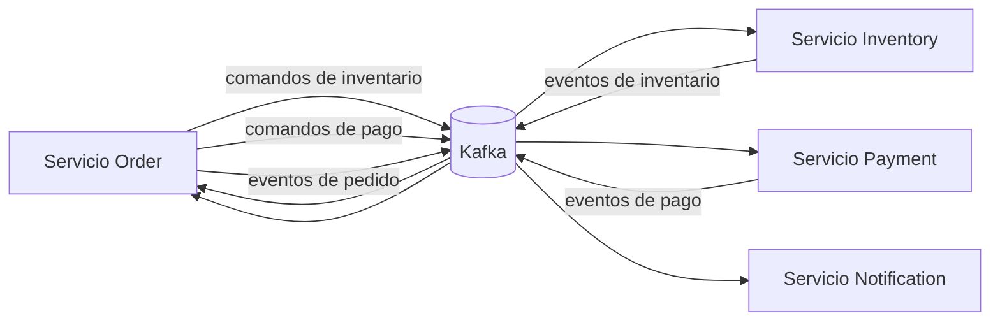

# Mensajería Kafka

Kafka es la frontera de integración asíncrona entre Order, Inventory, Payment y Notification. Los comandos solicitan trabajo en otro contexto delimitado; los eventos comunican un hecho de negocio definitivo. Cada servicio es propietario de sus DTO de transporte locales y no se comparte ningún contrato compilado ni biblioteca de dominio.

## Estructura y metadatos

Cada registro JSON contiene `messageId`, `messageType`, `correlationId`, el campo anulable `causationId`, `aggregateId`, `occurredAt` en UTC, `version` y `payload`. La versión 1 es el contrato inicial. `messageType` es el discriminador en el protocolo; los nombres de paquetes Java/Kotlin y las cabeceras de tipo del serializador no forman parte del contrato.

En el flujo de trabajo actual, `correlationId` y `aggregateId` son el UUID de Order. Un resultado recién generado obtiene un nuevo `messageId`, conserva la correlación entrante y utiliza el `messageId` entrante como `causationId`. Los mensajes raíz tienen una causa nula.

Cada registro utiliza `orderId` como clave de Kafka. La misma clave en el mismo topic selecciona normalmente la misma partición, por lo que Kafka garantiza el orden dentro de esa partición. No garantiza un orden global entre topics ni en todo el flujo de trabajo distribuido.

## Comportamiento de entrega

Los consumidores utilizan grupos explícitos, desactivan las confirmaciones automáticas y confirman en modo `RECORD` únicamente después de que el consumidor y el manejador de aplicación finalicen correctamente. Los productores utilizan claves de tipo String, valores JSON de tipo String y `acks=all`. El resultado es una entrega con capacidad at-least-once: los duplicados siguen siendo posibles y la deduplicación genérica mediante `messageId` se ha pospuesto deliberadamente.

Los topics locales y de pruebas utilizan tres particiones y un factor de replicación 1. El aprovisionamiento de producción debe conservar estos nombres, elegir la capacidad de forma deliberada y utilizar un factor de replicación mayor. La creación automática de topics por el broker no es una estrategia de aprovisionamiento para producción.

## Limitaciones conocidas

- Un commit en la base de datos local y una publicación en Kafka no son operaciones atómicas; Transactional Outbox se ha pospuesto.
- No se ha implementado un almacenamiento genérico de mensajes procesados o de idempotencia.
- El proyecto no dispone de una política de retry topics o Dead Letter Topics.
- El proceso distribuido completo no es una Saga/Process Manager explícita y persistida.
- Notification recibe actualmente la identidad del cliente, pero no existe una consulta de sus datos de contacto; el adaptador utiliza una dirección de desarrollo no enrutable hasta que se incorpore esa integración.

Estos son límites deliberados de este incremento centrado exclusivamente en Kafka. No hay transacciones Kafka, garantías exactly-once, Schema Registry, Avro, Protobuf ni serialización nativa de Java.

## Inspección local

Configure `KAFKA_BOOTSTRAP_SERVERS`, inicie cada servicio con su dependencia de PostgreSQL y utilice cualquier consumidor estándar de consola de Kafka con `--property print.key=true`. Las pruebas automatizadas de Kafka inician su propio broker mediante Testcontainers y no requieren esta configuración.
