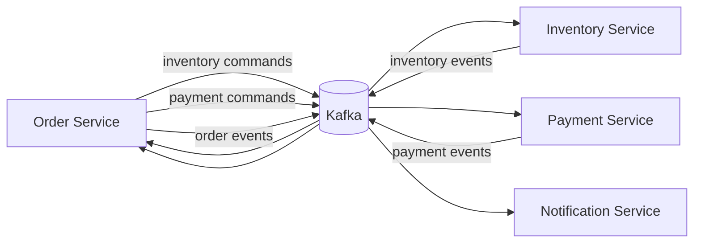

# Kafka messaging

Kafka is the asynchronous integration boundary between Order, Inventory, Payment, and Notification. Commands request work in another bounded context; events report a definitive business fact. Every service owns its local transport DTOs, and no compiled contract or domain library is shared.

## Envelope and metadata

Every JSON record contains `messageId`, `messageType`, `correlationId`, nullable `causationId`, `aggregateId`, UTC `occurredAt`, `version`, and `payload`. Version 1 is the initial contract. `messageType` is the wire discriminator; Java/Kotlin package names and serializer type headers are not contracts.

For the current workflow, `correlationId` and `aggregateId` are the Order UUID. A newly produced result gets a new `messageId`, preserves the incoming correlation, and uses the incoming `messageId` as `causationId`. Root messages have a null cause.

Every record uses `orderId` as its Kafka key. The same key on the same topic normally selects the same partition, so Kafka provides ordering within that partition. It does not provide global ordering across topics or the entire distributed workflow.

## Delivery behavior

Consumers use explicit groups, disable automatic commits, and acknowledge in `RECORD` mode only after the listener and application handler return successfully. Producers use string keys, JSON string values, and `acks=all`. The result is at-least-once-capable delivery: duplicates remain possible and generic `messageId` deduplication is intentionally deferred.

Local/test topics use three partitions and replication factor 1. Production provisioning should retain these names, choose capacity deliberately, and use a larger replication factor. Broker automatic topic creation is not a production provisioning strategy.

## Known limitations

- A local database commit and Kafka publication are not atomic; Transactional Outbox is deferred.
- Generic processed-message/idempotency storage is not implemented.
- There is no project retry-topic or Dead Letter Topic policy.
- The complete distributed process is not an explicit persisted Saga/Process Manager.
- Notification currently receives customer identity, but no customer-contact lookup exists; the adapter uses a non-routable development address until that integration is introduced.

These are deliberate boundaries of this Kafka-only increment. There are no Kafka transactions, exactly-once claims, Schema Registry, Avro, Protobuf, or Java native serialization.

## Local inspection

Set `KAFKA_BOOTSTRAP_SERVERS`, start each service with its PostgreSQL dependency, and use any standard Kafka console consumer with `--property print.key=true`. Automated Kafka tests start their own broker with Testcontainers and do not require this setup.
