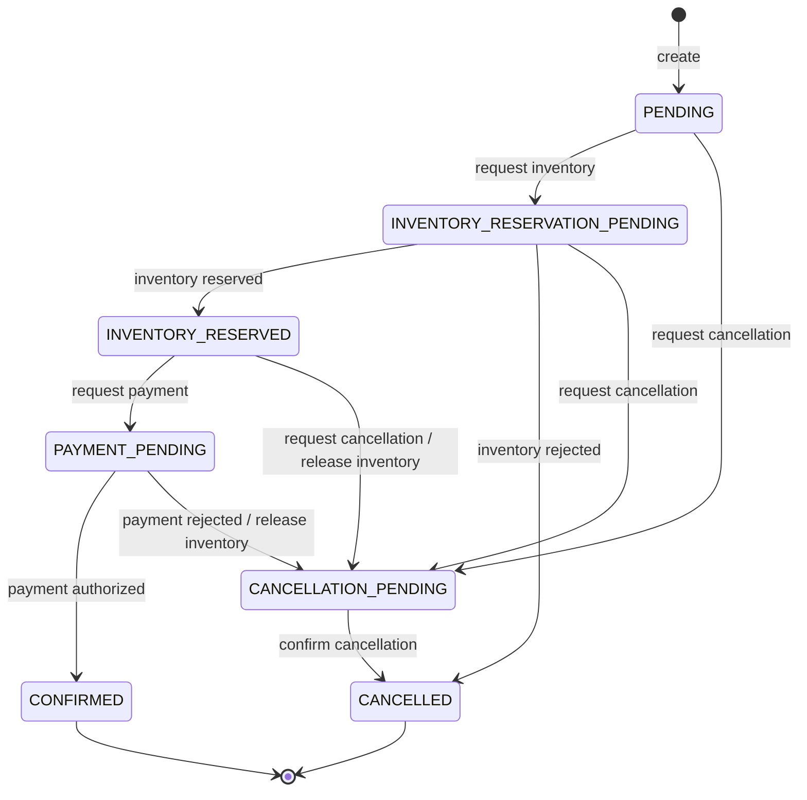

# Order Service

The Order bounded context owns order creation, pricing, lifecycle rules, and the state needed to continue the future distributed order saga after a restart.

For a class-by-class walkthrough, request flow, persistence explanation, error mapping, and test map,
see [the detailed code guide](docs/code-guide.md). Production classes and methods also contain
Javadoc next to their implementation so the design intent remains visible while navigating code.

## Domain model

`Order` is the aggregate root. It contains immutable `OrderLine` values and uses explicit domain types for order, customer, product, quantity, money, and payment-method identities. The aggregate calculates its own EUR total and exposes behavior-oriented transitions instead of generic state setters.

The implemented invariants include:

- every order has at least one line;
- quantities are positive and prices are non-negative;
- money uses `BigDecimal`, carries a currency, and currently accepts EUR only;
- payment cannot start before inventory has been reserved;
- a confirmed order cannot use the pre-confirmation cancellation transition;
- invalid transitions are rejected, while already-completed success/rejection callbacks are idempotent;
- persisted totals must still match the rehydrated lines.

## Lifecycle

Creating an order immediately requests inventory reservation, leaving the persisted order in `INVENTORY_RESERVATION_PENDING`. The asynchronous response use cases advance the remaining lifecycle.



## REST API

### Create an order

`POST /api/orders`

```json
{
  "customerId": "9529327d-97de-4c85-b2cc-389538c44f3c",
  "items": [
    {
      "productId": "PRODUCT-001",
      "quantity": 2,
      "unitPrice": 59.99
    }
  ],
  "paymentMethodId": "pm-test-success"
}
```

A successful request returns `201 Created`, a `Location` header, and an order representation:

```json
{
  "orderId": "b8ec88ff-e2ca-41ef-a487-1d64fd168fcb",
  "status": "INVENTORY_RESERVATION_PENDING",
  "total": 119.98,
  "currency": "EUR",
  "createdAt": "2026-09-07T10:00:00Z",
  "updatedAt": "2026-09-07T10:00:00Z"
}
```

### Retrieve an order

`GET /api/orders/{orderId}` returns the same representation or `404 Not Found`.

Errors consistently contain `timestamp`, HTTP `status`, application `code`, safe `message`, and request `path`. Transport validation errors are `400`, domain invariant violations are `422`, and infrastructure or unexpected failures are `500` without exposing stack traces.

## Architecture

The code follows a hexagonal layout:

- `domain`: aggregate, value objects, invariants, and technology-neutral domain events;
- `application/port/in`: concrete creation, query, inventory-result, and payment-result use cases;
- `application/service`: orchestration that loads, invokes domain behavior, persists, and publishes;
- `application/port/out`: repository, clock, ID generator, and messaging boundaries;
- `adapter/in/rest`: Bean Validation, transport mapping, thin controller, and error handling;
- `adapter/out/persistence`: JPA entities, Spring Data repository, mapper, and repository adapter;
- `adapter/out/messaging`: the current no-op local publisher.

PostgreSQL schema changes are managed by Flyway. Hibernate validates the schema and does not create it. Orders persist their lifecycle status, timestamps, calculated total, currency, lines, and optimistic-lock version.

## Code documentation

The [code guide](docs/code-guide.md) explains the end-to-end request paths, every production class,
domain transitions, persistence mapping, error flow, and test responsibilities. Package-level Javadoc
describes each architectural area, while class and method Javadoc stays beside the implementation.

Generate the browsable API documentation with:

```shell
./gradlew javadoc
```

The generated entry point is `build/docs/javadoc/index.html`.

## Running locally

Provide a PostgreSQL database and optionally override these defaults:

| Variable | Default |
| --- | --- |
| `ORDER_DB_URL` | `jdbc:postgresql://localhost:5433/orderflow_orders` |
| `ORDER_DB_USERNAME` | `orderflow` |
| `ORDER_DB_PASSWORD` | `orderflow` |
| `ORDER_SERVICE_PORT` | `8081` |

For local development, `order-service/compose.yaml` defines the `order-postgres` service with a
healthcheck. Database files survive container replacement in the named `order-postgres-data`
volume. Port `5433` is used on the host so Inventory PostgreSQL can continue to use `5432`.

Start the database first, then the application:

```shell
docker compose up -d --wait order-postgres
./gradlew bootRun
```

The database can also be managed independently:

```shell
docker compose up -d --wait order-postgres
docker compose down
```

Run those commands from `order-service/`. Keeping each service's Compose lifecycle independent
prevents Spring Boot from discovering two competing PostgreSQL connection definitions.

## Testing

```shell
./gradlew test
```

Domain and ordinary application-service tests run without Spring. Integration tests use a disposable PostgreSQL Testcontainer to verify Flyway, persistence/rehydration, and the REST-to-database path; they are skipped when Docker is unavailable.

## Future Kafka role

Domain events and result-handler input ports already express the integration boundary, but no Kafka classes or serialization contracts are present. The local publisher deliberately performs no transport work, so REST and PostgreSQL remain fully functional without Kafka. A later integration commit can add Kafka inbound/outbound adapters without changing the domain or application use cases.
