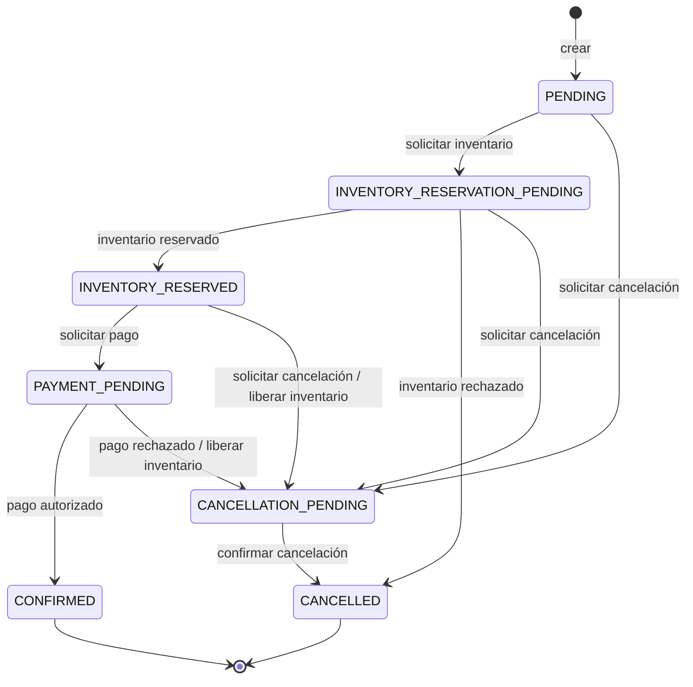

# Servicio de pedidos

El contexto delimitado de Order es responsable de crear y valorar pedidos, de las reglas de su ciclo de vida y del estado necesario para continuar la futura saga distribuida de pedidos después de un reinicio.

Para consultar un recorrido clase por clase, el flujo de las peticiones, una explicación de la persistencia, el mapeo de errores y el mapa de pruebas,
véase [la guía detallada del código](docs/code-guide.md). Las clases y los métodos de producción también incluyen
Javadoc junto a su implementación para que la intención del diseño permanezca visible al navegar por el código.

## Modelo de dominio

`Order` es la raíz del agregado. Contiene valores `OrderLine` inmutables y utiliza tipos de dominio explícitos para las identidades de pedido, cliente, producto y método de pago, además de la cantidad y el dinero. El agregado calcula su propio total en EUR y expone transiciones orientadas al comportamiento en lugar de métodos genéricos para asignar el estado.

Las invariantes implementadas incluyen:

- todo pedido tiene al menos una línea;
- las cantidades son positivas y los precios no son negativos;
- el dinero utiliza `BigDecimal`, incluye una divisa y actualmente solo admite EUR;
- el pago no puede comenzar antes de que se haya reservado el inventario;
- un pedido confirmado no puede utilizar la transición de cancelación previa a la confirmación;
- las transiciones no válidas se rechazan, mientras que las notificaciones de éxito o rechazo ya completadas son idempotentes;
- los totales persistidos deben seguir coincidiendo con las líneas rehidratadas.

## Ciclo de vida

Al crear un pedido se solicita inmediatamente la reserva de inventario y el pedido persistido queda en `INVENTORY_RESERVATION_PENDING`. Los casos de uso de respuesta asíncrona hacen avanzar el resto del ciclo de vida.



## API REST

### Crear un pedido

`POST /api/orders`

```json
{
  "customerId": "9529327d-97de-4c85-b2cc-389538c44f3c",
  "items": [
    {
      "productId": "PRODUCT-001",
      "quantity": 2,
      "unitPrice": 59.99
    }
  ],
  "paymentMethodId": "pm-test-success"
}
```

Una petición correcta devuelve `201 Created`, una cabecera `Location` y una representación del pedido:

```json
{
  "orderId": "b8ec88ff-e2ca-41ef-a487-1d64fd168fcb",
  "status": "INVENTORY_RESERVATION_PENDING",
  "total": 119.98,
  "currency": "EUR",
  "createdAt": "2026-09-07T10:00:00Z",
  "updatedAt": "2026-09-07T10:00:00Z"
}
```

### Consultar un pedido

`GET /api/orders/{orderId}` devuelve la misma representación o `404 Not Found`.

Los errores contienen de forma coherente `timestamp`, el `status` HTTP, el `code` de la aplicación, un `message` seguro y el `path` de la petición. Los errores de validación del transporte son `400`, las infracciones de invariantes del dominio son `422` y los fallos de infraestructura o inesperados son `500`, sin exponer trazas de pila.

## Arquitectura

El código sigue una estructura hexagonal:

- `domain`: agregado, objetos de valor, invariantes y eventos de dominio independientes de la tecnología;
- `application/port/in`: casos de uso concretos de creación, consulta y resultados de inventario y pago;
- `application/service`: orquestación que carga, invoca el comportamiento del dominio, persiste y publica;
- `application/port/out`: límites de repositorio, reloj, generador de identificadores y mensajería;
- `adapter/in/rest`: Bean Validation, mapeo de transporte, controlador ligero y gestión de errores;
- `adapter/out/persistence`: entidades JPA, repositorio de Spring Data, mapeador y adaptador de repositorio;
- `adapter/out/messaging`: publicador local sin operaciones utilizado actualmente.

Flyway administra los cambios del esquema de PostgreSQL. Hibernate valida el esquema, pero no lo crea. Los pedidos persisten el estado de su ciclo de vida, las marcas temporales, el total calculado, la divisa, las líneas y la versión de bloqueo optimista.

## Documentación del código

La [guía del código](docs/code-guide.md) explica los recorridos completos de las peticiones, cada clase de producción,
las transiciones del dominio, el mapeo de persistencia, el flujo de errores y las responsabilidades de las pruebas. El Javadoc de paquete
describe cada área arquitectónica, mientras que el Javadoc de clases y métodos permanece junto a la implementación.

La documentación navegable de la API se genera con:

```shell
./gradlew javadoc
```

El punto de entrada generado es `build/docs/javadoc/index.html`.

## Ejecución local

Debe proporcionarse una base de datos PostgreSQL. Estos valores predeterminados se pueden sobrescribir de forma opcional:

| Variable | Valor predeterminado |
| --- | --- |
| `ORDER_DB_URL` | `jdbc:postgresql://localhost:5433/orderflow_orders` |
| `ORDER_DB_USERNAME` | `orderflow` |
| `ORDER_DB_PASSWORD` | `orderflow` |
| `ORDER_SERVICE_PORT` | `8081` |

Para el desarrollo local, `order-service/compose.yaml` define el servicio `order-postgres` con una
comprobación de estado. Los archivos de la base de datos sobreviven al reemplazo del contenedor en el volumen con nombre
`order-postgres-data`. En el anfitrión se utiliza el puerto `5433` para que el PostgreSQL de Inventory pueda seguir utilizando el `5432`.

Primero se inicia la base de datos y, a continuación, la aplicación:

```shell
docker compose up -d --wait order-postgres
./gradlew bootRun
```

La base de datos también se puede administrar de forma independiente:

```shell
docker compose up -d --wait order-postgres
docker compose down
```

Estos comandos deben ejecutarse desde `order-service/`. Mantener independiente el ciclo de vida de Compose de cada servicio
evita que Spring Boot descubra dos definiciones de conexión de PostgreSQL incompatibles entre sí.

## Pruebas

```shell
./gradlew test
```

Las pruebas de dominio y las pruebas ordinarias de los servicios de aplicación se ejecutan sin Spring. Las pruebas de integración utilizan un Testcontainer desechable de PostgreSQL para verificar Flyway, la persistencia y rehidratación, y el recorrido desde REST hasta la base de datos; se omiten cuando Docker no está disponible.

## Integración con Kafka

Order publica `ReserveInventoryCommand` y `ReleaseInventoryCommand` en `order.inventory.commands`, `AuthorizePaymentCommand` en `order.payment.commands` y los eventos finales de pedido en `order.events`. Consume los eventos de resultado de Inventory y Payment mediante los grupos explícitos `order-service.inventory-events` y `order-service.payment-events`.

Los adaptadores Java intercambian los mismos contratos JSON documentados que consumen y producen los servicios Kotlin. Los eventos de dominio permanecen separados de los mensajes de integración. Order sigue siendo el lugar natural para una futura saga persistida de cumplimiento, aunque este incremento solo añade el transporte.
